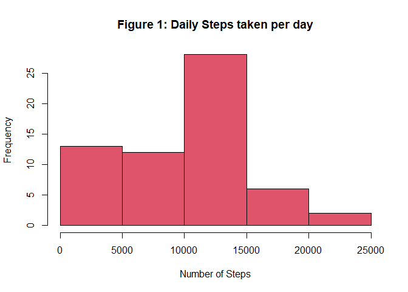
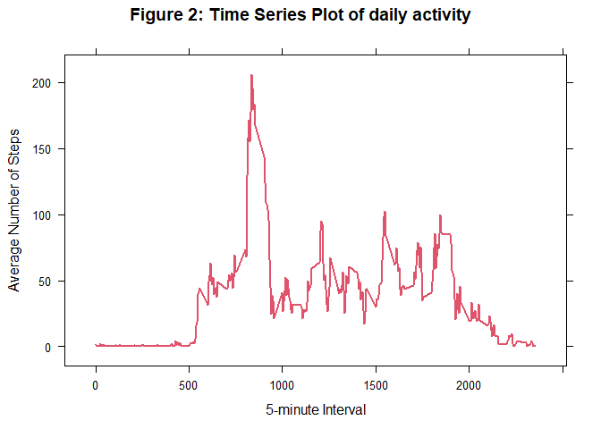
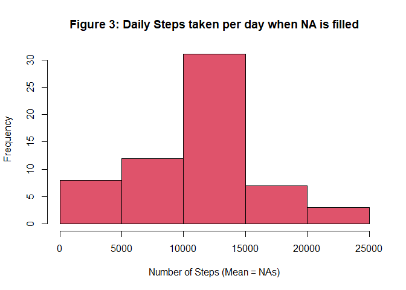
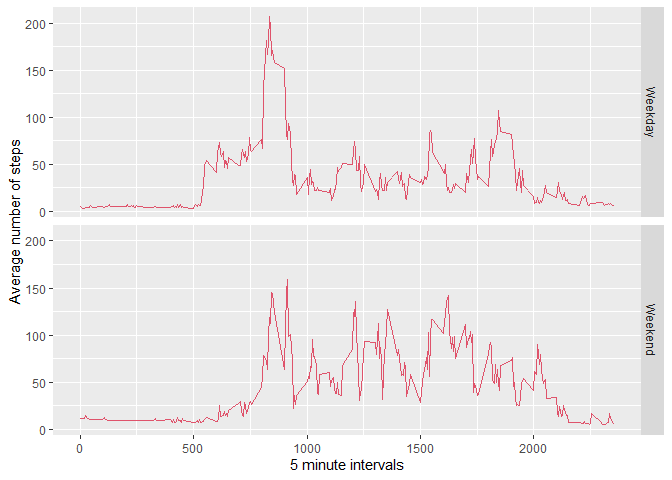

### Reproducible Research Project 1

- Load packages and read data into a dataframe  
- set echo equals to TRUE   
- Set second column into "date" class  


```r
library(knitr)
library(ggplot2)
library(dplyr)
```

```
## 
## Attaching package: 'dplyr'
```

```
## The following objects are masked from 'package:stats':
## 
##     filter, lag
```

```
## The following objects are masked from 'package:base':
## 
##     intersect, setdiff, setequal, union
```

```r
library(lattice)
opts_chunk$set(echo = TRUE)

nike_data <- read.csv( unzip("activity.zip"),
                sep=",",
                na.strings = "NA",
                colClasses =c("numeric","Date","numeric"))


str(nike_data)
```

```
## 'data.frame':	17568 obs. of  3 variables:
##  $ steps   : num  NA NA NA NA NA NA NA NA NA NA ...
##  $ date    : Date, format: "2012-10-01" "2012-10-01" ...
##  $ interval: num  0 5 10 15 20 25 30 35 40 45 ...
```
### What is mean total number of steps taken per day?

Calculate the total number of steps taken per day ignoring NA.
Make a histogram of the total number of steps taken each day.


```r
step_day <- tapply(nike_data$steps,nike_data$date,function(x) sum(x,na.rm=TRUE))
hist(step_day,col=10 ,xlab="Number of Steps", main="Figure 1: Daily Steps taken per day")
```

<!-- -->

Then, we calculate the mean and median of the total number of steps taken per day:


```r
step_mean <-mean(step_day, na.rm = T)
step_median<- median(step_day,na.rm=TRUE)
step_mean
```

```
## [1] 9354.23
```

```r
step_median
```

```
## [1] 10395
```
### What is the average daily activity pattern?


```r
steps_pattern <- aggregate(nike_data$steps ~ nike_data$interval, nike_data, FUN=mean, na.rm=T)

names(steps_pattern) <- c("interval","average_steps")

xyplot(steps_pattern$average_steps ~ steps_pattern$interval, 
       type = "l", ylab = "Average Number of Steps", 
       xlab ="5-minute Interval",
       main = "Figure 2: Time Series Plot of daily activity", lwd = 2,
       col = 10)
```

<!-- -->
Find the maximum interval


```r
highest <- which.max(steps_pattern$average_steps)
highest
```

```
## [1] 104
```
It can be seen that 104th interval, which is around 9 hours if divided by 12

### Imputing missing values

First, calculate the number of missing values. Impute the missing values
by taking the mean of the 5 minute interval calculated from above 

```r
sum(is.na(nike_data$steps))
```

```
## [1] 2304
```

```r
sub_nas <- nike_data[is.na(nike_data),]
sub_nas$steps <- merge(steps_pattern, sub_nas)$average_steps
nike_data_fill <- nike_data
nike_data_fill[is.na(nike_data),] <- sub_nas
daily_steps_fill <- tapply(nike_data_fill$steps,nike_data_fill$date,function(x)
  sum(x,na.rm=TRUE))
```
Then, make a histogram of the total number of steps taken each day and calculate and report the mean and median total number of steps taken per day. 

```r
hist(daily_steps_fill, col=10 ,xlab="Number of Steps (Mean = NAs)", main="Figure 3: Daily Steps taken per day when NA is filled")
```

<!-- -->

```r
mean(daily_steps_fill)
```

```
## [1] 10766.19
```

```r
median(daily_steps_fill)
```

```
## [1] 11015
```
It is seen than steps that are lesser than 10000 daily has decrease when Na is substituted with the mean.The mean and median also increases

### Are there differences in activity patterns between weekdays and weekends?
Create a new factor variable in the dataset with two levels – “weekday” and “weekend” indicating whether a given date is a weekday or weekend day.


```r
daytype <- function(date) {
        if (weekdays(as.Date(date)) %in% c("Saturday", "Sunday")) {
                "Weekend"
        } else {
                "Weekday"
        }
}
nike_data_fill$daytype <- as.factor(sapply(nike_data_fill$date, daytype))
nike_data_fill$day <- sapply(nike_data_fill$date, FUN = daytype)
```
Make a panel plot containing a time series plot of the 5-minute interval (x-axis) and the average number of steps taken, averaged across all weekday days or weekend days (y-axis). 


```r
averages <- aggregate(steps ~ interval + day, data = nike_data_fill, mean)
ggplot(averages, aes(interval, steps)) + geom_line(color=10) + facet_grid(day ~ .) + xlab("5 minute intervals") + ylab("Average number of steps")
```

<!-- -->


